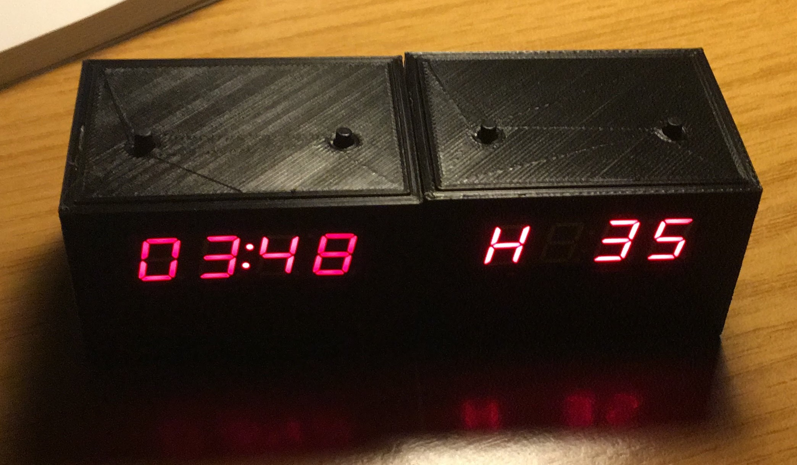

# 7 Segments Display Clock

DIY clock using seven-segment display, ATtiny2313A and optionaly an DHT sensor.

# Structure of this repository

* CAD Files (STL).
* Code for Mikro C Proyect.
* KiCAD proyect with schematic and PCB Design.

## Prerequisites

To carry out this project, it is essential to have a PCB (the one attached in this project or a similar one) in which to solder all the components.

The circuit can also be mounted in an equivalent way on a breadboard following the connection diagram.

A series of electronic components are needed. Below are the recommended components for the realization of the project. Some of them can be replaced by equivalent ones, for example: the value of the resistors, capacitors, mcu (also fucniona with the ATtiny2313), etc.

Compilation and programming tools are also needed. Below are the recommended ones

### Components

List of electronics component nedded:

1. ATtiny2313 (or equivalent)
2. Crystal quartz oscilator 11.0Mhz
3. 4 Digit seven segment display
4. 22pF capacitors
5. Resistor (view schematic)
6. Button switches
7. Some pin 2.54mm connectors 

### Tools needed

1. Programmer. I've used a (Pololu USB AVR Programmer v2)[https://www.pololu.com/product/3170], but you can use another one compatible with the mcu (PICkit, AVRISP XPII... )
2. Compiler. Mikro C AVR Compiler. There are a free versión limited by de memory size of the program to burn into de mcu.
3. Software to load hex file into mcu, using a programmer. I've used (AVRDudess)[https://blog.zakkemble.net/avrdudess-a-gui-for-avrdude/]